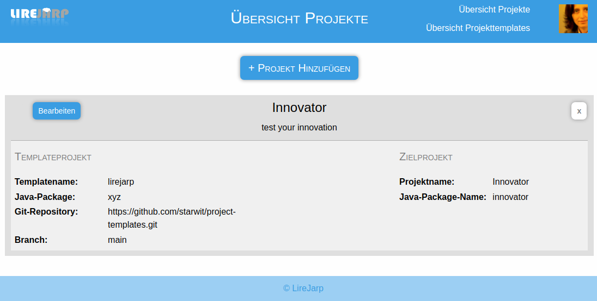

# Project Builder

## Further Information
* [build and release project](docs/build-release-mgmt.md)
* [installation on local PC](docs/local-installation.md)
* [how to create templates](docs/templates-howto.md)
* [architecture description for developer](docs/architecture.md)

## Motivation

Creating modern software always requires a number of things to do. One of these things is to persist data and to access persisted data. Finally the data should be presented in a userfriendly manner. Yet still a lot of boiler plate code needs to be written and creating application quickly remains a challenge. Lirejarp Project Builder is an application to kickstart new project via using templates. The Project Builder provides a configuration interfaces for creating new projects and applications.

## Prerequisites

* Kubernetes Cluster
* Helm

## Installation

Go to helm/ljprojectbuilder
- copy values-template4private.yaml to values-private.yaml and add secret values
- execute e.g.:
  - for local cluster: `helm install ljprojectbuilder . -n ljprojectbuilder -f values.yaml -f values-private.yaml`
  - for hetzner cluster: `helm install ljprojectbuilder . -n ljprojectbuilder -f values.yaml -f values-hetzner.yaml`

## Screenshot

