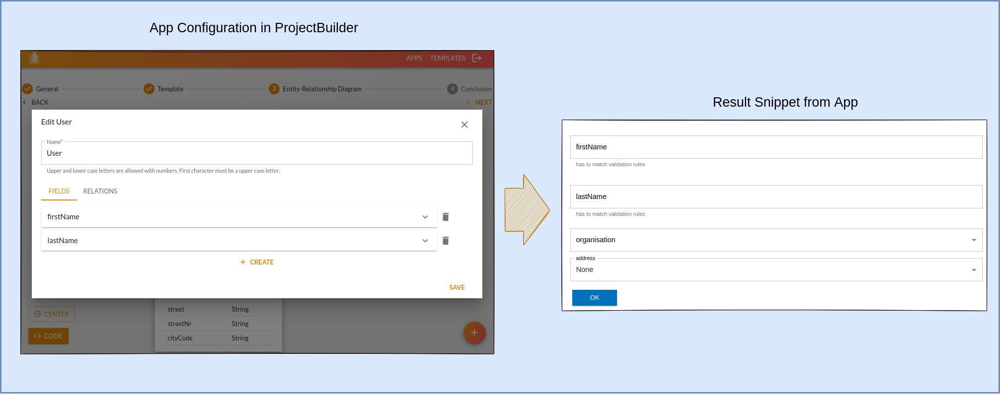

<p align="center">
    
    <h1 align="center">Project Builder</h1>
</p>

## Purpose

ProjectBuilder helps to speed up the creation and deployment of new applications. It kickstarts new projects based on templates and app-specific configuration.

Code snippets can be easily transformed into templates and used in future applications. It helps companies to manage their software stack and minimize maintenance costs.

<p align="center"></p>

ProjectBuilder is deployed at https://pb.starwit.de/.
Contact info@starwit.de for access and more information.

## Contribution

We are grateful for any contribution. Please refer to our [contribution guideline](CONTRIBUTING.md) and instructions document for any information.

## Documentation

* [Development Installation](docs/installation/development-installation.md)
* [Architecture Description](docs/architecture.md)
* [Build and Release Project](docs/build-release-mgmt.md)
* [Deployment Options](docs/deployment.md)
* [Workflow Documentation](.github/workflows/readme.md)

## Documentation Template Creation
* [how to create templates](docs/templates-howto.md)

## Installation with docker-compose

You can install the last version of projectBuilder with database via docker-compose:

```shell
cd deployment
docker-compose up
```
This is only recommended for first testing and not for production use.

## Sponsors

Contact us on info@starwit.de to become a sponsor.

