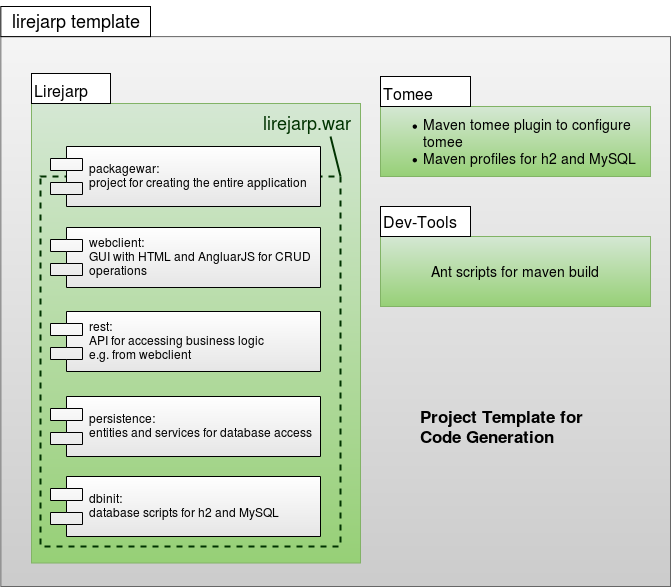

# Architecture

[Back](../README.md)

## Abstract

Yet still a lot of boilerplate code needs to be written and creating JEE application quickly remains a challenge.
Therefore, approach described here shall provide a guide in how to setup an architecture implementing persistence and a
RESTful interface layer. To do that properly a (reusable) pattern of inheritance + generic data types is proposed.
This (yet unnamed) pattern is applied in persistence, Enterprise Java Beans and in RESTful web service implementation
and therefore proved to be quite flexible. If you want to build an web-application, Project Builder provides you a
platform to fulfill your ideas. Nevertheless, you have all flexibility to change your application. If you want to have a
software which is easy to implement and easy to change, you should use standards. You will find these standards in the
lirejarp project template.

The project builder itself is based on the same project structure like the lireparp template. So the following
description is valid for both. The project, based on JEE-standards, is build via maven and is parted in subprojects
shown in the diagram below. For faster handling, an ant-file is provided. So, assumed ant, maven and JDK 1.8 are
installed, you just need to execute ant setup_project on command line to install and start the project. By executing ant
info you can find several other parts helping to deal with the project. The project consists of several subprojects
depicted in the following diagrams.
Subprojects of lirejarp template

The following subprojects exist in every project built with lirejarp project builder:

### persistence

This subproject contains classes for database access. Transactions are ensured through Enterprise Java Beans, if the
database supports transactions.

### rest

This subproject enables the access from UI via RESTful webservices.

### webclient

The UI logic is placed in the webclient project. ReactJS is used. The Frontend is utilized
with [Material-UI](https://www.mui.com) and its design structure (mostly based on [JSS](https://cssinjs.org/?v=v10.8.1))
.

### packagewar

The deployment of the project is done via war-file. It contains the projects persistence and rest as jar-files and the
webclient. The project packagewar is resonsible for the build.

## Additional projects in lirejarp project builder

In lirejarp project builder, two additional projects are implemented:

### generator

The generator project contains all logic to generate projects configured with the lirejarp project builder.

### dbautoinit

In this project, all database scripts are placed. Through flyway, these scripts are executed automatically in the
DEV-mode. Two databases are supported: h2 and mysql. In system.properties of the tomee-configuration, you can configure,
which database is used: flyway.database=h2 lirejarp project puilder with the additional subprojects.

## About implementing data access

You have a group of objects which are different in its structure but should implement the same basic behavior. You have
a lots of data objects in your application for whom the standard CRUD-functionality should be provided? For this
purpose, an AbstractDao is a common way to handle the implementation of the basic stuff. An AbstractEntity is created as
base class for all entities. In the AbstractDao general CRUD functions are implemented using the AbstractEntity.
E.g. http://sidaof.sourceforge.net/sidaof/ is a project, which implements an AbstractDao-class. Binding concrete
entities to AbstractDao is done via generics.

The architecture presented here goes further and uses this pattern through all layers of the entire architecture:
business services (EJBs), RESTful webservices and junit-tests. Data objects extends the class “AbstractEntity”. Each
kind of service (EJB, restful webservice, jUnit-testclass) implements the general functionality around the data objects
in an abstract class. For each data object and each kind of service concrete service-implementations are added. To
prevent class-casts, generics ensure the usage of concrete data object in the abstract part of the implementation.

The following class-diagram provides an overview of the architecture. The description afterwards is given a better
understanding of the diagram.

### Entities for data access

The lirejarp template uses JPA for data access. Hence, database table definitions and validation is defined in the
entities.

### Services to deal with entities and save data

With the help of the generic approache, all entities can be saved and deleted using the same functionality. The
implementation of the service class contains only specific behavior.

### REST API

RESTful webservices are used as interface between business logic and web UI – a easy and common used way to strictly
separate UI and business logic.

### The Web UI

The User Interface should be changeable easily and without additional deployment. AngularJS is used to enable it.

### Code generation

Code generation via freemarker enables publishing of an entire running application via lirejarp project builder. The
intent is to help to do the first step and using a standardized way to implement standard functionality. So, you will
just generate once and change the code in the way you want. This pragmatic approach avoids a complex code generation.

## Advantage

You are really fast on creating or extending the backend of small JEE-applications. You avoid writing boiler-plate code
because you do not have to implement general functionality in each part of the architecture. You just have to implement
additional stuff like special queries. For instance you have an News Entity and you want to diplay all news of the day.
Because it is implement only once, all methods doing the same have the same names. Class-casts form abstract to concrete
classes are prevented by using Generics.

## Disadvantage

Everywhere abstract classes are used, the risk of deep class hierarchies occurs. This can be avoided by using
composition or transfer logic in separate classes.
