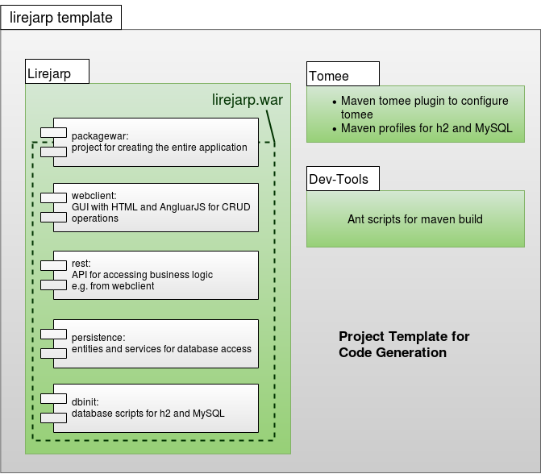

# Architecture

[Back](../README.md)

## Abstract
Yet still a lot of boilerplate code needs to be written and creating applications quickly remains a challenge. If you want to build an web-application, ProjectBuilder provides you a platform to fulfill your ideas. Nevertheless, you have all flexibility to change your application. If you want to have a software which is easy to implement and easy to change, you should use standards. You will find these standards in the starwit project templates.

The project builder itself is based on the same project structure like the [starwit/reacthook-spring-template](https://github.com/starwit/reacthook-spring-template). The following description is valid for both. The project, based on Spring Boot is build via maven and is parted in subprojects shown in the diagram below.
Subprojects of lirejarp template

The following subprojects exist in every project built with projectBuilder:
### application
This subproject defines the over-all spring boot application. It contains spring boot application configuration and is needed to build the application.
### persistence
This subproject contains classes for database access. In this project, all database scripts are placed. Through flyway, these scripts are executed automatically during project start. Two databases has to be supported with the scripts: h2 (for tests) and mysql.
### rest
This subproject enables the access from UI via RESTful webservices.
### webclient
The UI logic is placed in the webclient project. React is used. The Frontend is utilized with [Material-UI](https://www.mui.com) and its design structure (mostly based on [JSS](https://cssinjs.org/?v=v10.8.1)).

## ProjectBuilder specific
In lirejarp ProjectBuilder, one additional project is implemented:
### generator
The generator project contains all logic to generate projects configured with the ProjectBuilder.

Code generation via freemarker enables publishing of an entire running application via lirejarp project builder. The intent is to help to do the first step and using a standardized way to implement standard functionality. So, you will just generate once and change the code in the way you want. This pragmatic approach avoids a complex code generation.

