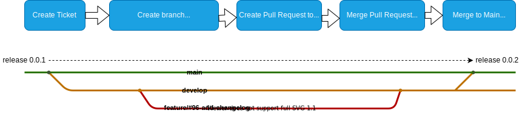

# Build and Release Management

## CICD Workflow

The following descriptions are based on gitflow best practices. Creating new features or bugfixes and release them is don by following steps:

1. Create feature ticket
2. Create new branche by using name `[feature|bugfix]/#<ticketNumber>-<description>`
3. Commit changes by using following message format: `<type>[optional scope]: <description>`. Types are: feat, fix, chore, docs, style, refactor, perf, test
4. Create PR for merge into develop. Merging to develop automatically executes build and publish for project
5. Create patch release by merging into main

By following the correct comit-message format, a changelog will be created automatically.

## Manual Execution

You can execute workflows manually:

* **buildpublish.yml (Build and Publish)** to test docker builds and pushes on your own branch.
* **createRelease.yml (Create release and tag)** 
    * use `prerelease` to check release creation or create a release for testing
    * use `major` or `minor` and execute script on main branch: to build additional major and minor release

(!) If you are executing patch or higher release on another branch than main, release numbering might get broken.
