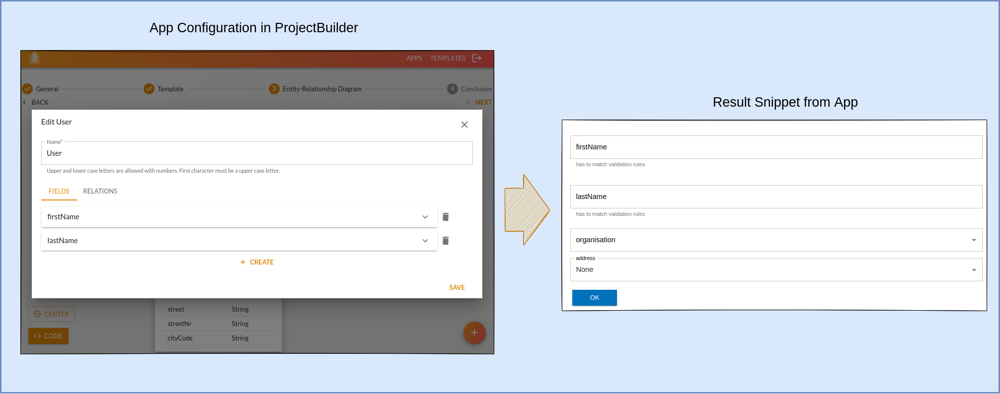

---

# Feel free to add content and custom Front Matter to this file.

# To modify the layout, see https://jekyllrb.com/docs/themes/#overriding-theme-defaults

layout: home
title: Home
---

    
    <h1 align="center">Project Builder</h1>

ProjectBuilder helps to speed up the creation and deployment of new applications. It kickstarts new projects based on
templates and app-specific configuration.

Code snippets can be easily transformed into templates and used in future applications. It helps companies to manage
their software stack and minimize maintenance costs.

## Demo

ProjectBuilder is deployed at [pb.starwit.de](https://pb.starwit.de/).
Contact [info@starwit.de](mailto:info@starwit.de) for access and more information.

## Contribution

We are grateful for any contribution. Please refer to our [contribution guideline](CONTRIBUTING.md) and instructions
document for any information.

## Documentation

* [Development Installation](installation/development-installation.md)
* [Architecture Description](architecture.md)
* [Build and Release Project](build-release-mgmt.md)
* [Deployment Options](deployment.md)

## Documentation Template Creation

* [Create Templates](docs/templates-howto.md)

## Sponsors

Contact us at info@starwit.de to become a sponsor.

