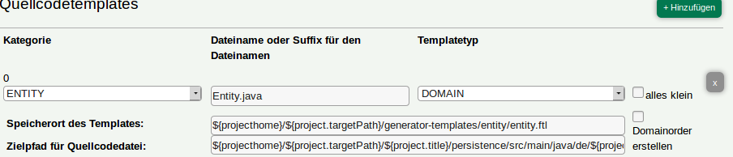

# How To for Templates
[Back](../README.md)

- [How to Create a Template](#how-to-create-a-template)
- [How to Configure Apptemplates](#how-to-configure-projecttemplates)
  * [project](#project)
  * [domain](#domain)
  * [attribute](#attribute)
- [Links](#links)

# How to use the Default Template

# How to load existing Template

# How to Create a Template

#### 1. Create Project and Push it to Git

For creating a template, you need a project saved into a git repository. The generator with substitude all occurrences of the name in the apptemplate later on.

#### 2. Start ProjectBuilder

Next, you have to download and start projectbuilder. You can build your own apptemplates by using the so called site in the projectBuilder. 

#### 3. Configure Projecttemplate

You can configure your codetemplates via [Freemarker](https://freemarker.apache.org/). It is used as templating language for configuring the path to code templates as well as in the template files itself. Use the properties in the [Template Configuration](#template-configuration) section to find out which properties you can use in the templates.

#### 4. Create a Project

The next step is the creation of the project itself. Create an new project in ProjectBuilder and choose your git-project and apptemplate and enter a name and description.

#### 5. Add Domains and Attributes

After successfully saving the general project settings, you can add your domain objects and attributes to the project. 

#### 6. Download your Project

Now, everything is prepared and you can download your new project.

# How to Configure Projecttemplates

### **project** 

The project-object contains general information and can be used to configure the paths for codetemplates-sets saved as apptemplate.

#### Example



#### Properties

| Name        | Description     |      Example  |
| ------------- |-------------| -------------|
| projecthome   | home directory | ${projecthome}|
| project.targetPath | directory where the template is checked out  | ${projecthome}/${project.targetPath}/generator-templates/entity/entity.ftl|
| project.title | name of the project | ${projecthome}/${project.targetPath}/${project.title}/persistence/ |
| project.template | project template used - not used in templates |  |
| project.packagePrefix | you can choose a package name which will be included in the Java-package path | ${projecthome}/${project.targetPath}/${project.title}/persistence/src/main/java/de/${project.packagePrefix?lower_case}/${project.title?lower_case}/entity/
| project.description | description of the project which is not used in templates | |
| project.domains | domain objects.   | |

### **domain**

The domain object is normally used in the template-files (*.ftl). Choose templatetyp DOMAIN to create separate template-files for domains.

#### Example
```
@Table(name="${domain.name?upper_case}")
public class ${domain.name}Entity extends AbstractEntity {
	
	private static final long serialVersionUID = 1L;
	
	//domain attributes
	<#list (domain.getAttributes()) as attribute> 
		<#if attribute.pattern?? && attribute.pattern?length &gt; 0 && attribute.dataType == "String">
	@Pattern(regexp = "${attribute.pattern}")
		</#if>	
		<#if attribute.dataType == "String">
			<#if !attribute.nullable>
```

#### Properties

| Name        | Description     |      Example  |
| ------------|-------------| -------------|
| domain.name | name of the domain | public class ${domain.name}Entity extends AbstractEntity { |
| domain.description | description of the domain | normally not used |
| domain.getAttributes() | used to get all attributes of a domain | <#list (domain.getAttributes()) as attribute> | 

### **attribute**

As shown in the example above, attribute is used in comination with a domain.

#### Example

```
<#if attribute.dataType == "Integer"> 
	@Column(name="${attribute.name?upper_case}"<#if !attribute.nullable>, nullable = false</#if>)
	public ${attribute.dataType} get${attribute.name?cap_first}() {
		return ${attribute.name};
	}
	</#if>
	<#if attribute.dataType == "BigDecimal"> 
	@Column(name="${attribute.name?upper_case}"<#if !attribute.nullable>, nullable = false</#if>)
	public ${attribute.dataType} get${attribute.name?cap_first}() {
		return ${attribute.name};
	}
</#if>
```

#### Properties

| Name        | Description     |      Example  |
| ------------|-------------| -------------|
| attribute.name | name of the attribute | @Column(name="${attribute.name?upper_case}" |
| attribute.description | description of the attribute | normally not used |
| attribute.pattern | Regex for validation of input | @Pattern(regexp = "${attribute.pattern}")| 
| attribute.dataType | | <#if attribute.dataType == "BigDecimal"> |
| attribute.min | String: minimum length of the String. Number: smallest number | |
| attribute.max | String: maximum length of the String. Number: highest number | |
| attribute.nullable | Is false if attribut value is required | <#if !attribute.nullable>, nullable = false</#if> |

