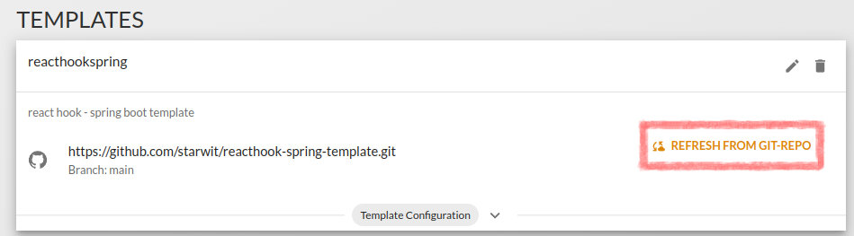

# How To for Templates
[Back](../README.md)

- [How load existing Templates](#how-to-load-existing-templates)
- [How to Create a Template](#how-to-create-an-own-template)

# How to load Existing Templates
## How to use the Default Template

In order to start with templating, you can use an already existing template. A default react template can be found [here](https://github.com/starwit/reacthook-spring-template).

1. If it is not already existing, you have to add it to the ProjectBuilder.

    * You can find the menu-item TEMPLATES in the header menu. It opens a list of all registered templates.
    * Check, if the following template configuration already exists:
        ```
        Git-Repository: https://github.com/starwit/reacthook-spring-template.git
        Branch: main
        Group: public
        ```
    * If there is no such configuration available, you can add the template by pressing the Add-Button located in the bottom-right corner:
        
    * A dialog appears where you can add template location and branch
        .
    * After adding the template, you have to load the template configuration into the database. Press "Refresh from Git-Repo"
        .

## How to use other Templates

Other templates can be integrated in the same way as the default template. Just add a new template definition in ProjectBuilder, fill in git-repository and branch and load the template configuration pressing "Refresh from Git-Repo".

:warning: If you forget "Refresh from Git-Repo", there will be an error generating the app.
# How to Create an Own Template

For creating a template, you need a project saved into a git repository. The generator will use it in order to create the app later on.

1. Create template structure
2. Add template configuration
3. Add templates
4. Write templates
5. Test template generation
6. Migation hints

## Create Template Structure

A template has to consist of the following parts:
* **`template-config.json`:** the template configuration. it contains template name, preview image and a list of all used templates and some properties for generation.
* **project directory:**
    * it is named after the template name configured in template-config.json
    * it contains the project structure and all files not having domain-specific content
* **`generator-templates` directory:** the place where all templates are stored
* **preview image:** the name of the preview image is also configured in `template-config.json`

As template creation has some complexity, it is recommanded to start with an existing template, e.g. the [default template](https://github.com/starwit/reacthook-spring-template).

## Add Template Configuration

The template configuration is done in `template-config.json` and can look like this:

```json
{
  "templateName": "reacthookspring",
  "packagePlaceholder": "starwit",
  "imageUrl": "https://raw.githubusercontent.com/starwit/reacthook-spring-template/main/screenshot.png",
  "templateFiles": [
    {
      "fileName": "${entity.name}Entity.java",
      "templatePath": "persistence/Entity.ftl",
      "targetPath": "persistence/src/main/java/de/${app.packageName?lower_case}/persistence/entity/",
      "category": "ENTITY"
    },
    {
      "fileName": "${enumDef.name}.java",
      "templatePath": "persistence/Enum.ftl",
      "targetPath": "persistence/src/main/java/de/${app.packageName?lower_case}/persistence/entity/",
      "category": "ENTITY"
    },
    {
      "fileName": "application.properties",
      "templatePath": "application/properties.ftl",
      "targetPath": "application/src/main/resources/",
      "category": "ENTITY"
    },
    ...
}
```
### Add General Attributes

You have to define the following attributes:

| property | type | mandatory | description | example |
|---|---|---|---|---|
|templateName | String | yes | name of the template. It is also the directory name where the general project structure should be saved. It is named project directory in the following text. | `"templateName": "reacthookspring",` |
| packagePlaceholder | String | yes | it is possible to define a name which will be substituted with the app-name in the whole project directory during generation. | `"packagePlaceholder": "starwit",` |
| imageUrl | String | no | the url of the template preview image | `"imageUrl": "https://raw.githubusercontent.com/starwit/reacthook-spring-template/main/screenshot.png",` |
| templateFiles | Array | no | a list of template files for generating domain-specific code |   `"templateFiles": [...]` |

## Add Templates
### The Usage of Freemarker

You can configure your templatefiles via [Freemarker](https://freemarker.apache.org/). It is used as templating language for configuring the path to code templates as well as in the template files itself. Use the properties in the [Template Configuration](#template-configuration) section to find out which properties you can use in the templates.
### Add Template Files

In order to have domain-specific files, you additionally have to add them to `template-config.json` (as alsready displayed in the example above).

| property | type | madatory | description | example |
|---|---|---|---|---|
|fileName | String | yes | the name of the generated file. You can use [freemarker substitution mechanism](#freemarker-substitutions-for-templatepath) | `"fileName": "${entity.name}Entity.java",` |
|templatePath | String | yes | the location ot the template based on the directory `generator-templates` | `"templatePath": "persistence/Entity.ftl",` |
|targetPath | String | yes | the location of the target folder based on project directory | `"targetPath": "application/src/main/resources/"` |
| append | Boolean | no | defines, if the generated content should be appended to the existing file (yes) or added as new file (no). Default value is no. | `"append": no,` |
|category | String | no | You can use it for getting a better overview of yout template configurations | `"category": "ENTITY"` |

### Freemarker Substitutions for TemplatePath and TargetPath

The following substitutions are valid in template path:

* `app` (or `project`<sup>depricated</sup>): all properties of the app defined in ProjectBuilder. See AppDto definition on https://pb.starwit.de/ljprojectbuilder/swagger-ui.html or definitions below
* `apphome` (or `projecthome`<sup>depricated</sup>): if templatepath starts with ${apphome} or ${projecthome}, you can define a special targetPath, otherwise `${apphome}/${app.targetPath}/${app.baseName}/"`
* `entity.name`: entity name defined in entity-relationship diagram
* `enumDef.name`: name of the enum defined in entity-relationship diagram
definition on https://pb.starwit.de/ljprojectbuilder/swagger-ui.html
* `domain.name`<sup>depricated</sup>: entity name defined in entity-relationship diagram

## Write Template Files

There are several objects you can use inside template files. The definition of these objects and implementation examples can be found here:
* [version 1 <sup>depricated</sup>](template-def-v1.md)
* [version 2](template-def-v2.md)

## Test Templates
### 1. Create a App

The next step is the creation of the project itself. Create an new project in ProjectBuilder and choose your git-project and apptemplate and enter a name and description.

### 2. Add Entities, fields, enums and relations

After successfully saving the general app settings, you can add your entities, fields, enums and relations to the app.
### 3. Download your App

Now, everything is prepared and you can download your new app. The template will be downloaded as zip file. if an error appeared, a concrete error message give you som hints, what went wrong.

### 4. Change Template

If you change the `template-config.json`, you need to "Refresh from Git-Repository" before Generation. If you are only changing the template files, you can choose an app from app view and press "Generate".
## Migration Hints

Changes from version 1:

* description fields are deleted
* template files is saved in Git-Repository and the name is `template-config.json`
* not needed properties were deleted from template definition
* database fields were added, migration scripts changed -> for migration, database script repository has to be rewritten according to the last deployed version